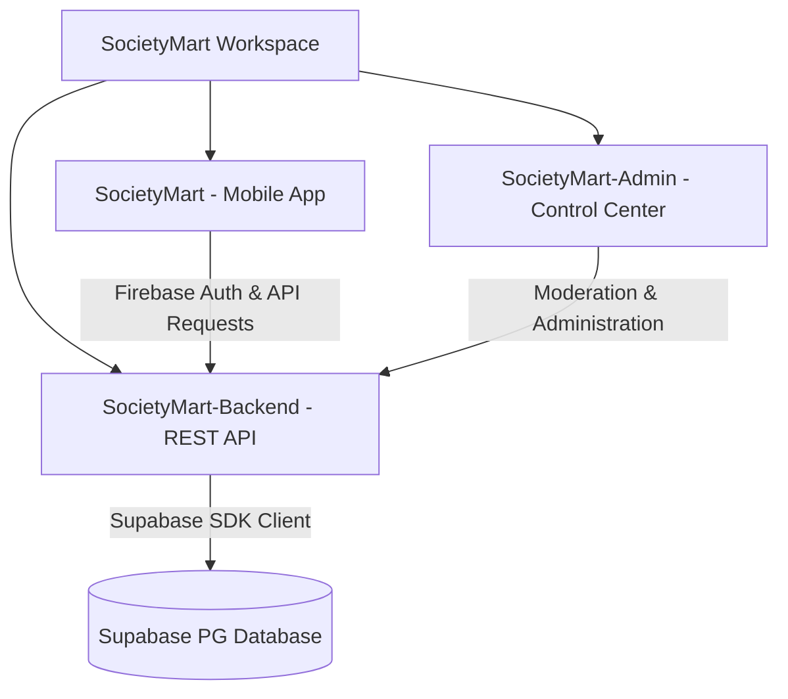

# 🏡 SocietyMart Control Hub & Monorepo

Welcome to the central repository for **SocietyMart** — a premium, full-stack, hyper-local food marketplace designed to connect passionate home chefs with their resident neighbors inside housing societies.

This repository is structured as a professional, production-grade **monorepo** comprising three perfectly synchronized modules:



---

## 📂 Monorepo Architecture

| Module | Purpose | Tech Stack | Link |
| :--- | :--- | :--- | :--- |
| **`SocietyMart`** | Gorgeous customer & chef mobile experience. | React Native, Expo, Firebase Auth, Expo Router | [Explore Frontend](./SocietyMart) |
| **`SocietyMart-Backend`** | Highly secure core business logic REST API. | Node.js, Express, Supabase (PostgreSQL), Firebase Admin | [Explore Backend](./SocietyMart-Backend) |
| **`SocietyMart-Admin`** | Administrative console for operational oversight. | Express.js, EJS, Bootstrap 5, Plus Jakarta Sans Font | [Explore Admin Panel](./SocietyMart-Admin) |

---

## ✨ Core Features & Highlights

### 📱 1. Mobile Application (`SocietyMart`)
* **Instant Verification**: OTP sign-in powered by Firebase Phone Authentication.
* **Premium Brand Aesthetics**: Soft pastels, premium glassmorphism accents, and smooth micro-animations.
* **Dynamic Splash Screen**: Fetches customized welcome messages in real-time from the backend.
* **Fast Profile Customization**: Instant profile setup (Name, Phone, Society Selection, Flat/Villa details).
* **Double-Layer Auth Guards**: Expo Router segment listeners ensuring strict session protection.

### ⚙️ 2. Core REST API (`SocietyMart-Backend`)
* **Firebase Token Validation**: Middleware parsing and validating incoming Firebase Bearer JWT tokens.
* **Robust Database Integration**: Supabase (PostgreSQL) handling relational storage, listing directory queries, and profiles.
* **Clean API Schema**: Dedicated routes for `/api/auth`, `/api/dishes`, `/api/kitchens`, and `/api/splash`.

### 🛡️ 3. Admin Control Center (`SocietyMart-Admin`)
* **Live System Metrics**: Beautiful overview metrics measuring registered societies, chefs, listings, and buyers.
* **Society Hub Registrar**: Operational tools to register new housing communities with addresses and spatial coordinates.
* **Dish & User Directory Governance**: Ability to edit or delete active user entries and moderate dish listings.
* **Premium Calming Theme**: Elegant modern interface featuring dark headers (`#1A1A1A`), pink accents (`#e75480`), and the soothing **Plus Jakarta Sans** Google Font.

---

## 🛠️ Global Quick Start & Installation

### Prerequisite Setup
1. **Supabase Database**: Initialize a new database in your Supabase Console.
2. **Environment Configuration**: Create a `.env` file at the **workspace root** (which is automatically loaded by both backend and admin servers):
   ```ini
   # Supabase Configuration
   SUPABASE_URL=https://your-project-id.supabase.co
   SUPABASE_ANON_KEY=your-supabase-anon-key

   # Server Ports
   PORT=5001
   ADMIN_PORT=5002

   # Admin Login Credentials
   ADMIN_USERNAME=admin
   ADMIN_PASSWORD=admin123
   SESSION_SECRET=your-premium-cookie-session-secret-key
   ```
3. **Firebase Keys**: Save your Firebase Private Service Account Key inside `SocietyMart-Backend/serviceAccountKey.json` (This file is strictly ignored by Git for security).

---

### Running the Services

#### 🚀 1. Start the Core REST API
```bash
cd SocietyMart-Backend
npm install
npm run start
```
*API will be live at: `http://localhost:5001`*

#### 🛡️ 2. Start the Control Center (Admin Panel)
```bash
cd SocietyMart-Admin
npm install
npm run start
```
*Admin Dashboard will be live at: `http://localhost:5002` (Login: `admin` / `admin123`)*

#### 📱 3. Start the Mobile Client
```bash
cd SocietyMart
npm install
npx expo start
```
*Scan the QR Code using Expo Go (iOS/Android) or run on simulator.*

---

## 🗄️ Supabase Schema Configuration

To set up your database tables, run the following SQL scripts in your **Supabase SQL Editor**:

### 1. `societies` Table
```sql
CREATE TABLE societies (
  id UUID DEFAULT gen_random_uuid() PRIMARY KEY,
  name TEXT NOT NULL,
  address TEXT,
  latitude NUMERIC,
  longitude NUMERIC,
  created_at TIMESTAMP WITH TIME ZONE DEFAULT timezone('utc'::text, now()) NOT NULL
);
```

### 2. `users` Table
```sql
CREATE TABLE users (
  id UUID DEFAULT gen_random_uuid() PRIMARY KEY,
  phone TEXT UNIQUE NOT NULL,
  email TEXT,
  full_name TEXT,
  society_id UUID REFERENCES societies(id) ON DELETE SET NULL,
  flat_number TEXT,
  role TEXT CHECK (role IN ('buyer', 'seller', 'admin')),
  avatar_url TEXT,
  created_at TIMESTAMP WITH TIME ZONE DEFAULT timezone('utc'::text, now()) NOT NULL
);
```

### 3. `dishes` Table
```sql
CREATE TABLE dishes (
  id UUID DEFAULT gen_random_uuid() PRIMARY KEY,
  kitchen_id UUID REFERENCES users(id) ON DELETE CASCADE,
  name TEXT NOT NULL,
  price NUMERIC NOT NULL,
  description TEXT,
  image_url TEXT,
  category TEXT DEFAULT 'Meals',
  is_available BOOLEAN DEFAULT true,
  created_at TIMESTAMP WITH TIME ZONE DEFAULT timezone('utc'::text, now()) NOT NULL
);
```

---

## 🔒 Security & Git Shields
The repository is protected against credentials leak and build overhead via a unified, monorepo-level root `.gitignore` file:
* **Secrets Protected**: Private files like `serviceAccountKey.json`, `.env` and `*.pem` are blocked from public staging.
* **Clean Tracking**: System caches (`.expo/`), build directories (`dist/`, `web-build/`), and monorepo dependencies (`node_modules/`) are strictly untracked.

---
